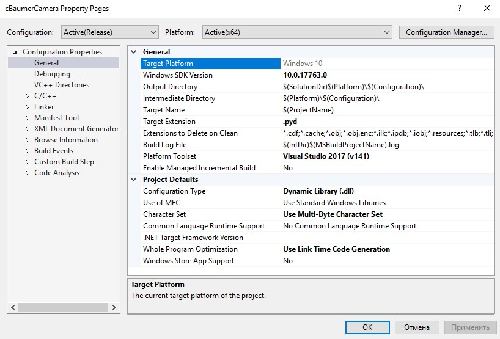
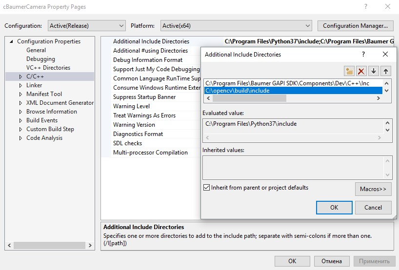
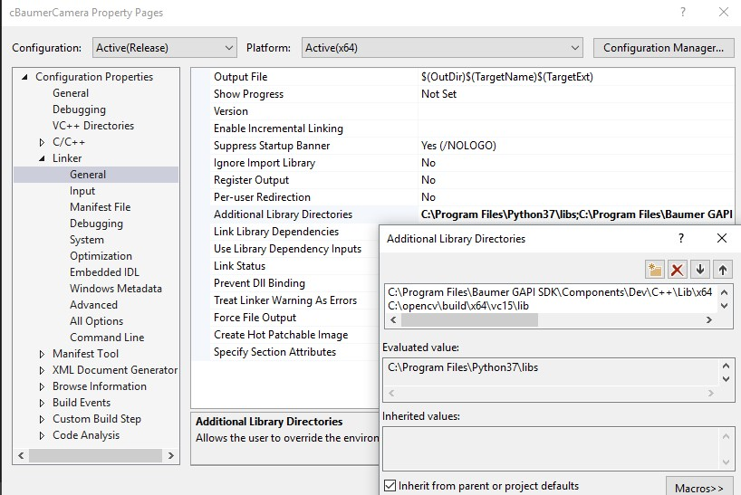
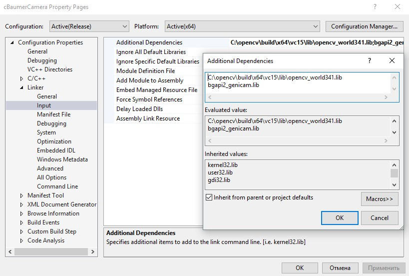
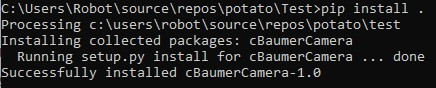
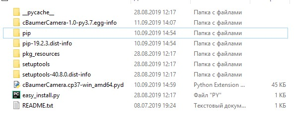
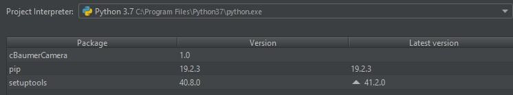
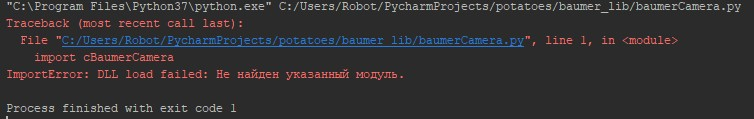

# Baumer-Camera-in-Python

Использовались следующие ссылки:

https://docs.microsoft.com/en-us/visualstudio/python/working-with-c-cpp-python-in-visual-studio?view=vs-2019
https://github.com/JacekPierzchlewski/CppClass4Python3/tree/master/car

Настройки проекта:

Установка модуля Python (pip install .):

Ошибка при import cBaumerCamera:

